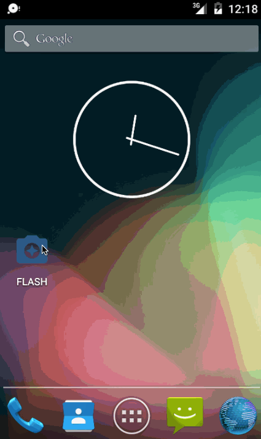

# Project 1 - Instagram Photo Viewer

**FLASH** is a read-only photo viewer for Instagram which allows a user to check out popular photos

Time spent: **7** hours spent in total

## User Stories

The following **required** functionality is completed:

* [X] User can **scroll through current popular photos** from Instagram
* [X] For each photo displayed, user can see the following details:
  * [X] Graphic, Caption, Username
  * [X] Relative timestamp, like count, user profile image

## Video Walkthrough 

Here's a walkthrough of implemented user stories:

GIF created with [LiceCap](http://www.cockos.com/licecap/).

## Open-source libraries used

- [Android Async HTTP](https://github.com/loopj/android-async-http) - Simple asynchronous HTTP requests with JSON parsing
- [Picasso](http://square.github.io/picasso/) - Image loading and caching library for Android

## License

    Copyright 2016 Sagar Nilesh Shah

    Licensed under the Apache License, Version 2.0 (the "License");
    you may not use this file except in compliance with the License.
    You may obtain a copy of the License at

        http://www.apache.org/licenses/LICENSE-2.0

    Unless required by applicable law or agreed to in writing, software
    distributed under the License is distributed on an "AS IS" BASIS,
    WITHOUT WARRANTIES OR CONDITIONS OF ANY KIND, either express or implied.
    See the License for the specific language governing permissions and
    limitations under the License.